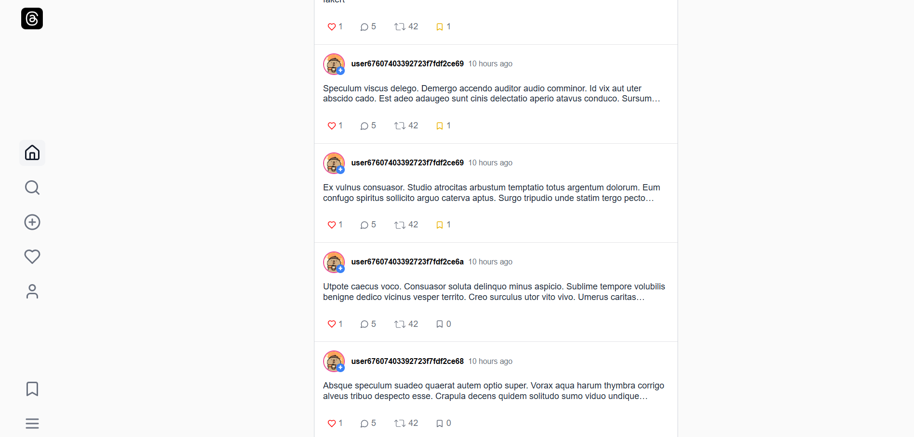

# Threads Replica Docs

Public documentation for a private full-stack social platform inspired by Threads.

The implementation repository stays private, but this site is public so recruiters and engineers can review the architecture, API design, data model, auth flows, testing approach, and engineering trade-offs without exposing proprietary code, secrets, or operational credentials.

## Live Docs

- https://hanguyentieuyen.github.io/threads-replica-docs/

## What I Built

- A React 18 + TypeScript single-page app with route guards, TanStack Query, Axios token refresh, and bilingual UI support.
- A Node.js + Express + TypeScript API organized around routes, Joi validation, controllers, services, and MongoDB collections.
- Social product flows including posts, comments, follows, reposts, bookmarks, user search, notifications, creator analytics, and direct messages.
- A hybrid realtime messaging design where REST remains the source of truth and Socket.IO keeps inbox state in sync.
- Frontend automated coverage with Vitest, Testing Library, MSW, and Playwright.

## Screenshot Preview

| Login                                                      | Home feed                                            |
| ---------------------------------------------------------- | ---------------------------------------------------- |
|  |  |

## What The Docs Cover

- System overview and feature scope
- Tech stack and architecture
- Data model and API organization
- Auth and security decisions
- Deployment shape and environment categories
- Testing strategy, current gaps, and future work

## Run Docs Locally

```bash
npm install
npm start
```

## Build Docs

```bash
npm run build
```

Built with Docusaurus and deployed as a public documentation site for portfolio review.
