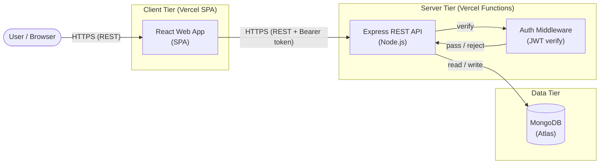
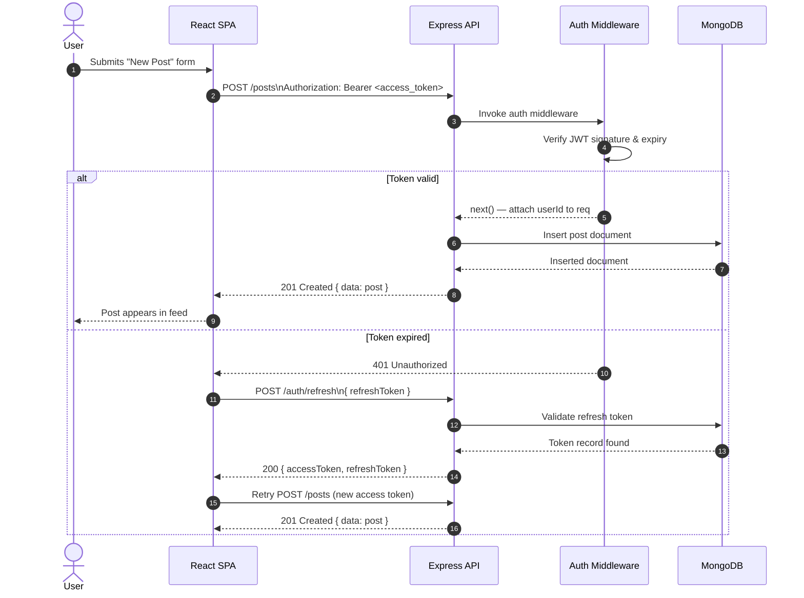

# Architecture

## High-level overview

The system follows a classic three-tier web architecture: a React single-page application in the browser, a Node.js/Express REST API on the server, and MongoDB as the primary data store. Both tiers are deployed on Vercel.



---

## Request lifecycle (authenticated call)

The following sequence diagram illustrates how a typical authenticated request (e.g., create a post) flows through the system.



---

## Component responsibilities

### React Web App (SPA)

- Renders all UI: feed, profiles, post detail, auth screens.
- Manages client-side routing (no full-page reloads).
- Maintains auth state (tokens in LocalStorage; see [Auth & Security](./auth-security)).
- Applies optimistic updates for likes and follows to keep the UI responsive.
- Handles token refresh transparently in the API client layer.

### Express REST API

- Implements business logic for all social features.
- Applies auth middleware to protected routes (JWT verification).
- Validates request payloads (body, params, query).
- Returns consistent JSON responses and standardized error codes.
- Delegates data access to the MongoDB layer.

### Auth Middleware (JWT verify)

- Reads the `Authorization: Bearer <token>` header on every protected request.
- Verifies the JWT signature using the configured secret.
- Checks token expiry (`exp` claim).
- Attaches the decoded `userId` to the request context for downstream handlers.

### MongoDB (Atlas)

- Primary storage for users, posts, replies, follow relationships, and likes.
- Indexes support the most common read patterns:
  - Posts by author and creation time (feed generation).
  - Follow pairs (follower, following) for feed queries and follow-status checks.
  - User lookup by email and username (login, profile).

---

## Deployment topology

```
Browser
  │
  ├── React SPA ──────────── Vercel Edge Network (CDN)
  │
  └── Express API ─────────── Vercel Serverless Functions
                                    │
                              MongoDB Atlas (cloud-hosted)
```

Both the SPA and the API are deployed to Vercel. The API runs as Vercel Serverless Functions, which auto-scales with traffic and requires no infrastructure management.
