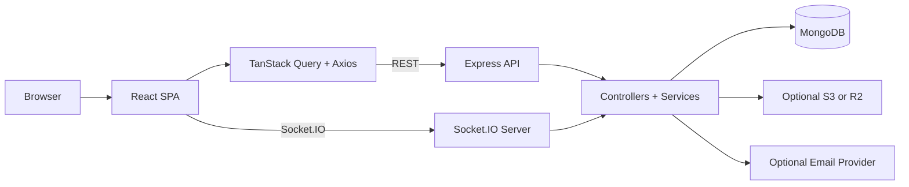
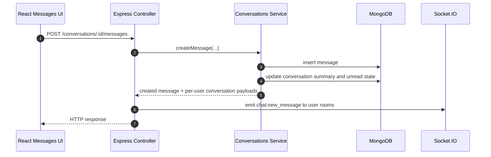

Threads Replica is built as a split frontend and backend system. The browser app handles routing, UI state, and cache synchronization, while the API owns persistence, validation, auth, and realtime messaging events.

## High-Level Shape

## Client Responsibilities

- `threads-web` defines public and protected routes in `router.tsx`.
- API calls are centralized in `src/apis/*` and shared through an Axios instance that attaches Bearer tokens and retries after refresh when an access token expires.
- TanStack Query handles paginated reads for feeds, profiles, saved posts, search, and message history.
- The chat client keeps a separate Socket.IO connection for direct-message events and unread-count synchronization.

## API Responsibilities

- `threads-api/src/index.ts` boots Express, JSON parsing, CORS, Swagger UI, route groups, database connection, and Socket.IO on the same HTTP server.
- Route files stay thin and delegate work to validators, controllers, and service classes.
- Joi validation runs before controller logic for headers, params, query strings, and bodies.
- MongoDB remains the system of record for posts, follows, bookmarks, notifications, conversations, and messages.

## REST Request Path

1. A route-level page or reusable component calls a module in `src/apis`.
2. The shared Axios client adds `Authorization: Bearer <access_token>` when the user is authenticated.
3. Express route middleware validates the request and verifies the access token.
4. The controller calls a service method.
5. The service reads or writes MongoDB and returns a JSON response with `message` and `data`.

## Realtime Message Path

## REST Versus Socket.IO

- REST is the source of truth for persisted data, pagination, and initial fetches.
- Socket.IO is used to push `chat:new_message` and `chat:conversation_read` events after the database update succeeds.
- Socket rooms are scoped to users and conversations, but user rooms drive the main message and inbox updates so unread badges still change even if a detail screen is not open.

## Notable Implementation Details

- Feed, profile, bookmark, and search reads rely heavily on MongoDB aggregation pipelines rather than a separate read model.
- The home feed starts with `following` and falls back to `for_you` on the client when the first page is empty.
- App startup creates a text index for post content search, but chat-specific indexes are not created automatically yet.
