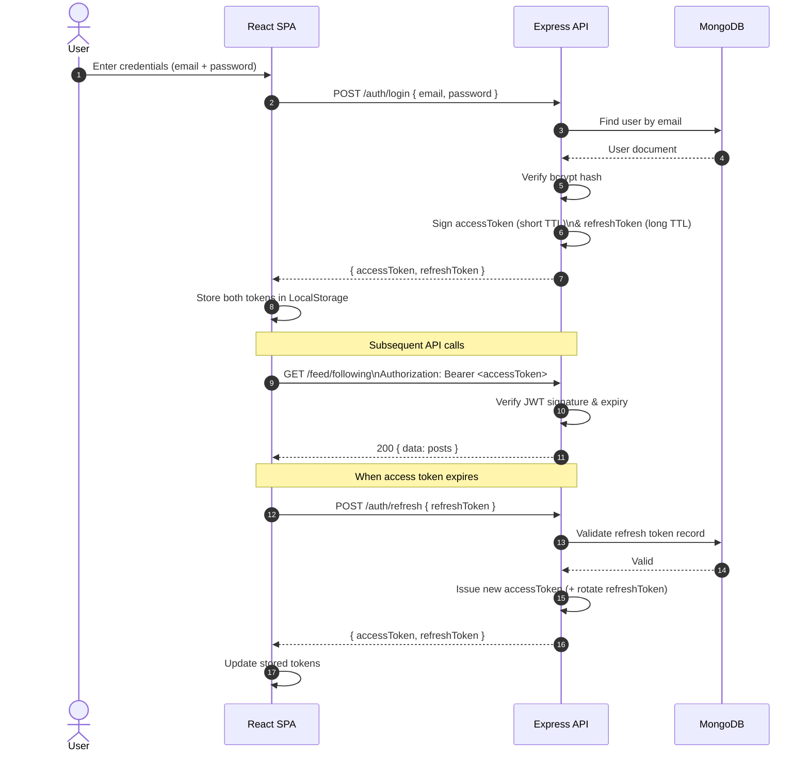

# Authentication & Security

## Authentication flow

Threads Replica uses a **JWT access + refresh token** scheme.

---

## Token strategy

| Property | Access Token | Refresh Token |
|---|---|---|
| Lifetime | Short (e.g., 15 min) | Longer (e.g., 7 days) |
| Sent with | Every authenticated request | Only to `/auth/refresh` |
| Storage | LocalStorage | LocalStorage |
| Invalidation | Expiry | Server-side record deletion (logout) |

### Refresh token rotation

On each refresh, a new refresh token is issued and the old one is invalidated. This limits the window of exposure if a refresh token is ever leaked.

---

## Token storage: LocalStorage

### Current implementation

Both tokens are stored in **LocalStorage** for simplicity. This is a widely used pattern for SPAs and works well when XSS vulnerabilities are properly mitigated.

### Security implications

Storing tokens in LocalStorage means any JavaScript running on the page can read them. The primary attack vector is **Cross-Site Scripting (XSS)**.

### Mitigations applied

| Mitigation | Description |
|---|---|
| Input sanitization | All user-supplied content is sanitized before storage and before rendering |
| Output encoding | Content is rendered through React's JSX (which escapes HTML by default) — `dangerouslySetInnerHTML` is avoided |
| Short-lived access tokens | Limits the impact window if a token is stolen |
| Refresh token rotation | Stolen refresh tokens are invalidated on next use |
| Content Security Policy | CSP headers restrict the sources of executable scripts |

### Recommended future improvement

Move the **refresh token to an HttpOnly Secure cookie** managed by the server. This removes the refresh token from JavaScript-accessible storage entirely, significantly reducing XSS impact.

---

## Authorization

### Route protection

All state-mutating and user-specific endpoints require a valid access token. The auth middleware verifies the JWT on every protected request before the route handler executes.

### Owner-only actions

Certain actions are restricted to the resource owner and enforced server-side:

| Action | Rule |
|---|---|
| Delete a post | `req.userId === post.authorId` |
| Update profile | `req.userId === target user id` |

### Principle of least privilege

- Users cannot read or modify other users' private data.
- The API does not return `passwordHash` or internal fields in any response.

---

## Input validation

All incoming request bodies and parameters are validated before processing:

- Required fields are checked for presence.
- String length limits are enforced (e.g., post content ≤ 500 characters).
- Email format is validated on registration.
- Numeric IDs and cursor tokens are type-checked.

Validation errors return `400 VALIDATION_ERROR` before any database interaction.

---

## Password security

- Passwords are **hashed with bcrypt** before storage. The raw password is never persisted.
- The hash is never included in any API response.

---

## Rate limiting

API rate limiting is applied to sensitive endpoints (login, register, refresh) to mitigate brute-force attacks. Rate limit errors return `429 RATE_LIMITED`.

---

## HTTPS

All traffic between the browser, Vercel Edge, and the API is served over **HTTPS**. Vercel enforces HTTPS by default.
