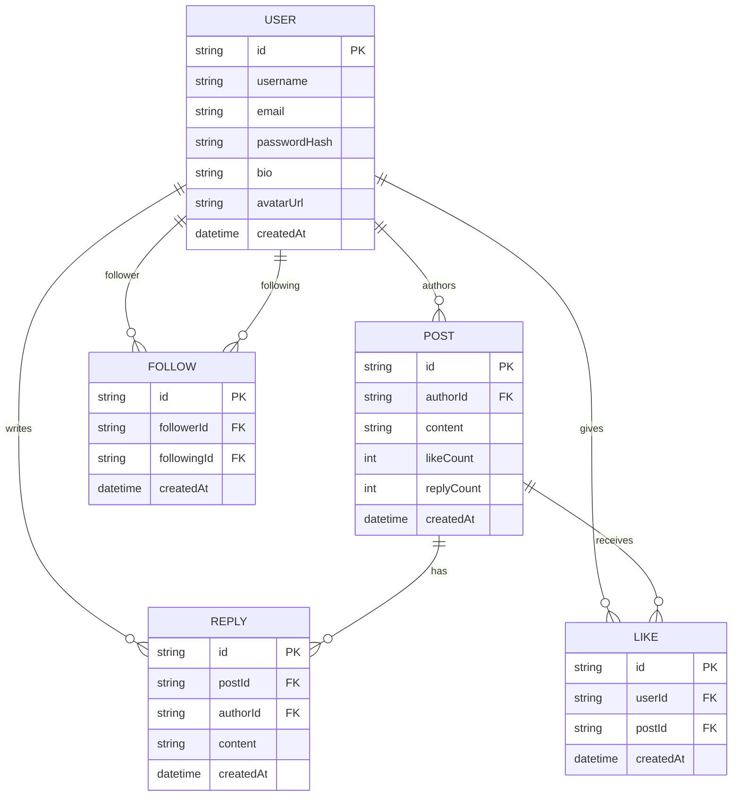

# Data Model (Conceptual)

> This section describes the conceptual data model. Field names, data types, and implementation details are intentionally simplified and do not reflect the private source code.

## Entity-Relationship Diagram

---

## Entity descriptions

### User

Represents an application account and its public profile.

| Field | Purpose |
|---|---|
| `id` | Unique identifier |
| `username` | Unique display name |
| `email` | Login credential (unique) |
| `passwordHash` | Bcrypt-hashed password (never returned in API responses) |
| `bio` | Optional short biography |
| `avatarUrl` | Reference to profile picture |
| `createdAt` | Account creation timestamp |

---

### Post

A top-level content item created by a user.

| Field | Purpose |
|---|---|
| `id` | Unique identifier |
| `authorId` | Reference to the creating user |
| `content` | Text content of the post |
| `likeCount` | Denormalized counter for fast reads |
| `replyCount` | Denormalized counter for fast reads |
| `createdAt` | Timestamp used for feed ordering |

---

### Reply

A user's response to a post.

| Field | Purpose |
|---|---|
| `id` | Unique identifier |
| `postId` | The post being replied to |
| `authorId` | The replying user |
| `content` | Text content of the reply |
| `createdAt` | Timestamp |

---

### Follow

A directed edge in the social graph: `follower → following`.

| Field | Purpose |
|---|---|
| `id` | Unique identifier |
| `followerId` | The user who follows |
| `followingId` | The user being followed |
| `createdAt` | Timestamp |

A unique compound index on `(followerId, followingId)` prevents duplicate follow relationships.

---

### Like

Records a user's "like" on a post.

| Field | Purpose |
|---|---|
| `id` | Unique identifier |
| `userId` | The liking user |
| `postId` | The liked post |
| `createdAt` | Timestamp |

A unique compound index on `(userId, postId)` ensures a user can only like a post once.

---

## Indexing strategy (high-level)

| Collection | Index | Purpose |
|---|---|---|
| Post | `(authorId, createdAt DESC)` | List posts by a user, newest first |
| Post | `(createdAt DESC)` | Global timeline (future) |
| Follow | `(followerId)` | Get all accounts a user follows |
| Follow | `(followingId)` | Get all followers of a user |
| Follow | `(followerId, followingId)` unique | Prevent duplicates, fast follow-status lookup |
| Like | `(userId, postId)` unique | Prevent duplicates, fast like-status lookup |
| Like | `(postId)` | Count/list likes per post |

---

## Feed generation pattern

To build the following feed for user `U`:

1. Query the `Follow` collection for all `followingId` values where `followerId = U`.
2. Query the `Post` collection for documents where `authorId IN [followingIds]`, sorted by `createdAt DESC`, with cursor-based pagination.

This "fan-out on read" approach is straightforward and works well at the current scale. A precomputed timeline (fan-out on write) would be considered if read latency becomes a concern at larger scale — see [Trade-offs & Future Work](./tradeoffs-future).
