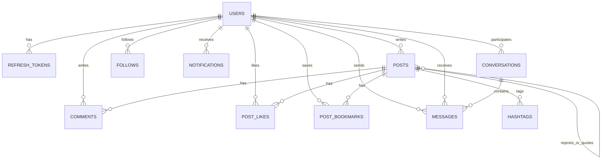

This page summarizes the conceptual data model behind the private implementation. It keeps the real domain relationships intact while leaving out low-value internal details and raw operational configuration.

## Core Relationships

## Entity Summary

| Entity | Purpose | Notable fields |
|---|---|---|
| `users` | Account, profile, and auth-adjacent user state | `verify`, `verify_email_token`, `forgot_password_token`, `username`, `avatar`, `post_circle` |
| `refresh_tokens` | Server-side refresh token records | `token`, `user_id`, `iat`, `exp` |
| `posts` | Top-level posts, reposts, and quote posts | `type`, `audience`, `parent_id`, `hashtags`, `mentions`, `medias`, `guest_views`, `user_views` |
| `comments` | Replies inside post discussions, including nested child comments | `post_id`, `parent_id`, `content`, `like_count` |
| `follows` | Directed follow graph | `user_id`, `followed_user_id` |
| `post_likes` | User-to-post like relation | `user_id`, `post_id` |
| `post_bookmarks` | User-to-post saved relation | `user_id`, `post_id` |
| `hashtags` | Named tags attached to posts | `name` |
| `notifications` | Activity records created by social events | `type`, `read`, `recipient_id`, `sender_id`, `resource_id`, `message` |
| `conversations` | 1-1 chat metadata | `participant_ids`, `participant_key`, `members`, `last_message_preview`, `last_message_at` |
| `messages` | Individual direct-message records | `conversation_id`, `sender_id`, `recipient_id`, `content`, `created_at` |

## Important Domain Enums

| Enum | Meaning in the system |
|---|---|
| `UserVerifyStatus` | Whether an account has completed email verification |
| `PostType` | Distinguishes normal posts, reposts, and quote posts |
| `PostAudience` | Controls whether a post is public or limited to a smaller circle |
| `FeedType` | Separates `following` from `for_you` feed reads |
| `MediaType` | Distinguishes image and video uploads |
| `NotificationType` | Follow, like, comment, and repost activity types |

## Modeling Notes

- Post visibility is not just public-versus-private. The `post_circle` and `PostAudience` fields allow a narrower "few someone" audience path in the current model.
- Post counts such as likes, comments, reposts, and bookmarks are mostly derived in read pipelines instead of being stored directly on the base post document.
- Chat data is more intentionally denormalized: conversation documents embed per-user unread state and last-message summary fields so the inbox can be rendered without re-querying message history for every row.

## Chat Model In Context

The messaging feature uses two collections together:

- `conversations` stores participant membership, per-user unread state, and inbox preview data.
- `messages` stores the immutable text records that belong to each conversation.

That split keeps direct-message history append-only while still making the inbox cheap to sort and render.
